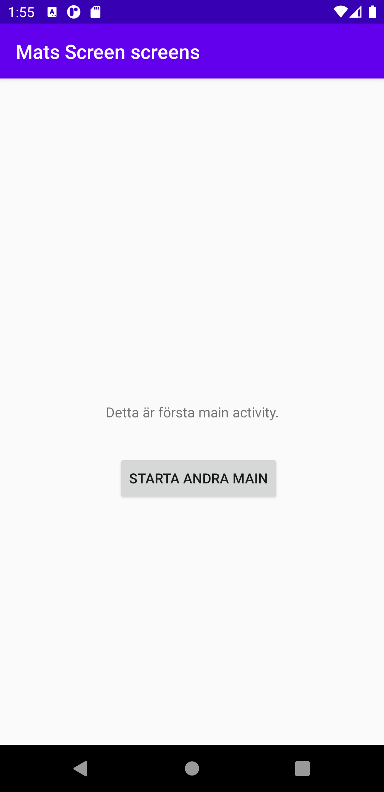
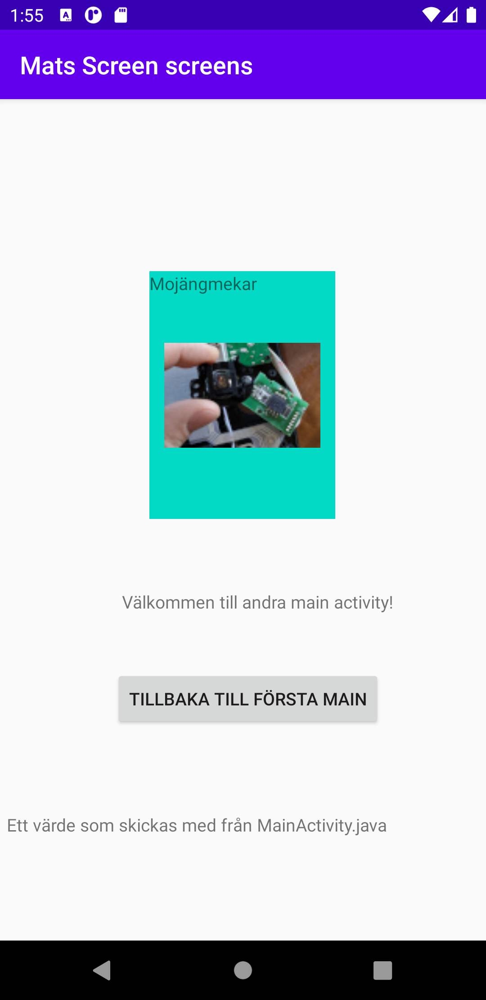

# Mats Läth Screens

Starten
-------
Då konstruerandet av appen startade gick det mycket smidigt. Skapandet av en andra main java och tillhörande XML fil gick väldigt bra  
lösa med hjälp av instruktionsfilmen som tillhandahålls på youtube. Dock då punkten nåddes
för att skapa java-koden som skickar användaren från appens första screen till appens
andra screen uppstod en del huvudbry. (se kod 1.) Vid punkten för ```intent.putExtra``` och de bitarna som ska vara i dess parantes
spenderades en hel timma på att felsöka något som inte var fel. Anledningen var att undertecknads ide inte betedde sig exakt som
i den instruerande filmen. Vilket undertecknads ide hade gjort om undertecknad hade fortsatt skriva färdigt i parantesen, så här i
efterhand är det trots allt lite roligt för det var så dumt.

Fortsättningen
--------------
Då funktionaliteten fanns där med en knapp i MainActivity.java som skickar ett värde till appens andra screen var det dags att lägga till en
knapp på appens andra screen som gör att det går att hoppa tillbaka till appens första screen. På appens andra screen tas värdet emot från den  
första screenen (se kod 2). Detta görs genom att screen 2 har ett textelement som vi lägger in det översända värdet i genom if satsen och dess id.

Fragment
--------
På appens andra sida lades en fragment till enligt uppgiftsbeskrivningen, och i fragment valdes att lägga till ett bildelement med en bild som en widget.
Det hela gick smidigt och bilden placerades (liksom allt övrigt i appen) med constraint layout. Skillnaden mellan allt övrigt material i appen är att
bildwidgeten är placerad inuti och i förhållande till fragmentets ytterkanter (se kod 3). Något som dock är lite förvirrande är att bilden till fragment
läggs med i activity_main2.XML filen och positioneras tillsammans med id för fragmentet, en spontan tanke i kunskapstörsten för undertecknad är att  
det naturliga vore att lägga den i fragment xmlfilen.

Slutligen
---------
Den här appen har byggts genom att till mycket stor del använda de grafiska verktygen i Android Studio. Dessa är mycket smidiga och snabba att använda
särskilt till positionering och att snabbt lägga ut nya element / widgetar att sedan arbeta vidare med.

```
Kod 1
startaAndraMainKnappen.setOnClickListener(new View.OnClickListener() {
            @Override
            public void onClick(View niceViewOpener) {
                Intent intent = new Intent(MainActivity.this, MainActivity2.class);
                intent.putExtra("name", "Ett värde som skickas med från MainActivity.java");
                startActivity(intent);
            }
        });
```
```
Kod 2
I xml
<TextView
        android:id="@+id/name"
        android:layout_width="wrap_content"
        android:layout_height="wrap_content"
        android:layout_marginTop="576dp"
        android:layout_marginEnd="80dp"
        android:layout_marginRight="80dp"
        android:text="Ett andra trevligt textfält"
        app:layout_constraintEnd_toEndOf="parent"
        app:layout_constraintTop_toTopOf="parent" />
I java
Bundle extras = getIntent().getExtras();
        if (extras != null) {
            String name = extras.getString("name");
            textView.setText(name);
        }
```
```
Kod 3
<ImageView
        android:id="@+id/imageView"
        android:layout_width="126dp"
        android:layout_height="95dp"
        app:layout_constraintBottom_toBottomOf="@+id/fragment"
        app:layout_constraintEnd_toEndOf="@+id/fragment"
        app:layout_constraintStart_toStartOf="@+id/fragment"
        app:layout_constraintTop_toTopOf="@+id/fragment"
        app:srcCompat="@drawable/jagmekar" />
```



